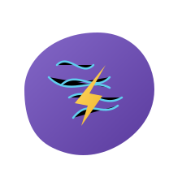
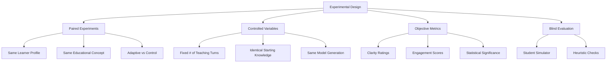
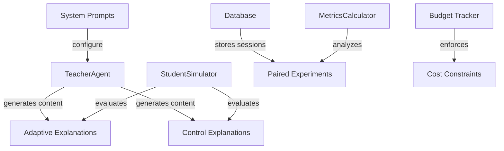

# synapz

<div align="center">
  
  <h3>adaptive learning for neurodiverse students</h3>
  <p>
    <a href="#thought-process--origins"></a>
    <a href="#experiment-design"></a>
    <a href="#initial-insights-and-contradictions"></a>
    <a href="#installation"></a>
  </p>
  <p><i>if learning isn't adapting to how you think, it isn't really teaching you</i></p>
</div>

## 📘 about

synapz is a research prototype exploring how large language models can adapt teaching content to different cognitive styles. built over a 48-hour sprint with a strict $50 api budget, this project implements a scientific framework to test whether adaptive teaching produces measurably better results than static approaches.

the project focuses on three cognitive profiles:
- **adhd learners** (challenges with attention, strengths in creative connections)
- **dyslexic learners** (text processing difficulties, conceptual understanding strengths)
- **visual learners** (preference for spatial organization over text)

synapz generates paired explanations of concepts (one adaptive, one static control) and evaluates them using simulated student feedback, objective metrics, and statistical analysis to determine which approach produces better learning outcomes.

## 🧠 core thesis

**adaptive teaching methodologies tailored to specific neurodiverse cognitive profiles produce measurably superior learning outcomes compared to static one-size-fits-all approaches.**

our hypothesis is that LLMs can be effectively employed to create personalized educational content that addresses the specific cognitive strengths and challenges of neurodiverse students. this project aims to:

1. implement and test adaptation mechanisms using prompt engineering and LLM interaction design
2. quantitatively measure the impact of these adaptations on learning effectiveness
3. identify which adaptation mechanisms are most effective for specific cognitive profiles

all within tight experimental constraints:
- 💰 $50 total api budget (enforced through pre-call token projection)
- ⏱️ 48-hour build timeframe (emphasizing efficient implementation)
- 🖥️ local compute only (m4 macbook, no custom model training)

## 🤔 thought process & origins

this project emerged from three converging observations:

1. **neurodiverse students often struggle** with traditional educational approaches designed for neurotypical learners
   
2. **personalized education works**, but implementation at scale requires automation and clear evidence

3. **llms have potential to adapt content** based on cognitive profiles, but lack rigorous evaluation

the core question became: can we prove, scientifically and on a limited budget, that adaptive approaches genuinely improve learning outcomes for different cognitive styles?

we specifically chose three distinct cognitive profiles to test:
- **adhd learners**: challenge with sustained attention but strong creative connections
- **dyslexic learners**: text processing difficulties but excellent conceptual understanding 
- **visual learners**: preference for spatial/visual information over text-heavy formats

rather than assuming adaptation works, we built an experimental framework to measure it directly.

## 🔬 experiment design

synapz implements a controlled experimental method with rigorous isolation of variables:



each experiment runs as a paired test with identical base conditions:

| adaptive session | vs | control session |
|:----------------:|:---:|:----------------:|
| adapts to learner's cognitive profile | | static approach for all learners |
| uses profile-specific prompts | | uses generic prompts |
| responds to feedback | | minimal adaptation to feedback |
| tailored for adhd, dyslexic, visual learners | | one-size-fits-all |

the simulation process leverages multiple evaluation mechanisms:
1. **LLM-based simulation** - gpt-4o simulates student responses based on profile characteristics
2. **heuristic assessment** - rule-based measurements check:
   - textual complexity (Flesch-Kincaid)
   - terminology density (domain-specific terms per paragraph)
   - pronoun usage patterns (matched to profile needs)
   - sentence length distribution (appropriate for cognitive style)
3. **statistical validation** - paired t-tests determine significance of differences

## 📊 current evidence (batch_run_20250518_091436)

<div align="center">
  <table>
    <tr>
      <td>
        <h4>Adaptive vs Control Win Rate (latest batch)</h4>
        <div align="center">
          <table>
            <tr>
              <th>Win Type</th>
              <th>Percentage</th>
            </tr>
            <tr>
              <td>Adaptive Wins</td>
              <td>40%</td>
            </tr>
            <tr>
              <td>Control Wins</td>
              <td>46.7%</td>
            </tr>
            <tr>
              <td>Ties</td>
              <td>13.3%</td>
            </tr>
          </table>
        </div>
        <!-- Using HTML img tag directly within the table cell -->
      </td>
      <td>
        <h4>Profile-Specific Results</h4>
        <table>
          <thead>
            <tr>
              <th>profile</th>
              <th>adaptive win %</th>
              <th>avg clarity</th>
              <th>p-value</th>
            </tr>
          </thead>
          <tbody>
            <tr>
              <td>dyslexic</td>
              <td>33.33%</td>
              <td>4.00 vs 2.33</td>
              <td>0.038*</td>
            </tr>
            <tr>
              <td>visual</td>
              <td>50.00%</td>
              <td>2.50 vs 3.00</td>
              <td>0.500</td>
            </tr>
          </tbody>
        </table>
        <em>* small sample size caution</em>
      </td>
    </tr>
  </table>
</div>

> ⚠️ **truth check:** our latest runs show **weak evidence** for the core thesis with only a 40% win rate for adaptive teaching across all profiles. we need more data and refined approaches for definitive conclusions.

### key visualizations from batch runs

<div align="center">
  <p>
    
  </p>
  <p>
    
  </p>
  <p>
    
  </p>
</div>

## 🔍 initial insights and contradictions

our early findings reveal some surprising patterns:

1. **superficial adaptation may not be enough** - merely changing the format (77.9% text difference between adaptive and control) doesn't guarantee better understanding

2. **profile-specific patterns are emerging**:
   - dyslexic learners show promising initial results with adaptive teaching
   - visual learners show mixed responses needing deeper investigation
   - small sample sizes limit confidence in these patterns

3. **simulator quality matters critically** - our current simulated students may not perfectly reflect real cognitive differences

4. **content differentiates but clarity doesn't always improve** - adaptation changes the content substantially, but doesn't consistently improve understanding

## 🛠️ system architecture

the system implements a model-view-controller architecture with specific components for experiment isolation:



### technical implementation

core components are designed for flexibility, testability and scientific rigor:

```python
# Example: TeacherAgent class with adaptive/control system selection
class TeacherAgent:
    def __init__(self, llm_client, db, teacher_model_name="gpt-4o"):
        self.llm_client = llm_client
        self.db = db
        self.teacher_model_name = teacher_model_name
        self._load_prompts()
        
    def create_session(self, learner_id, concept_id, is_adaptive=True):
        """Create a teaching session with specified adaptation mode."""
        session_type = "adaptive" if is_adaptive else "control"
        return self.db.create_session(learner_id, concept_id, session_type)
        
    def generate_explanation(self, session_id):
        """Generate explanation based on session type and history."""
        session = self.db.get_session(session_id)
        history = self.db.get_session_history(session_id)
        
        # Build appropriate system prompt based on session type
        system_prompt = self._build_system_prompt(
            session_id, 
            is_adaptive=(session["experiment_type"] == "adaptive")
        )
        
        # Format user query with concept information
        user_query = self._format_user_query(session, history)
        
        # Get structured JSON response from LLM
        response = self.llm_client.get_json_completion(
            system_prompt=system_prompt,
            user_prompt=user_query,
            model=self.teacher_model_name
        )
        
        # Process and store interaction
        return self._process_response(session_id, response)
```

our prompt engineering approach focuses on isolating adaptation variables:

```
# Simplified adaptive system prompt template
You are an educational AI customized to teach {learner_profile} students.
The student has the following cognitive profile: {profile_json}

Adapt your teaching style to match this profile's needs. 
Current concept to teach: {concept_json}

This is teaching turn #{turn_number}.
Previous clarity rating: {previous_clarity}

Use the following specific adaptations for this profile:
{profile_specific_instructions}
```

## 🚀 key features

<div align="center">
  <table>
    <tr>
      <th align="center">Feature</th>
      <th align="center">Description</th>
      <th align="center">Technical Details</th>
    </tr>
    <tr>
      <td><strong>targeted adaptation</strong></td>
      <td>content generation specifically designed for adhd, dyslexic, and visual learning profiles</td>
      <td>profile-specific system prompts + adaptive LLM chaining</td>
    </tr>
    <tr>
      <td><strong>scientific control</strong></td>
      <td>rigorous comparison against non-adapted teaching to isolate adaptation effects</td>
      <td>paired experiments with controlled variables and p-value calculation</td>
    </tr>
    <tr>
      <td><strong>quantitative metrics</strong></td>
      <td>statistical analysis including p-values, effect sizes, and text similarity measures</td>
      <td>Cohen's d calculations + Levenshtein distance + Flesch-Kincaid readability</td>
    </tr>
    <tr>
      <td><strong>budget tracking</strong></td>
      <td>strict openai api budget enforcement with pre-call cost projection</td>
      <td>token counting + model-specific pricing + pre-call budget validation</td>
    </tr>
    <tr>
      <td><strong>data management</strong></td>
      <td>reliable experimental data storage with concurrent access</td>
      <td>SQLite with WAL journaling + transaction safety + automated backup</td>
    </tr>
    <tr>
      <td><strong>automated evaluation</strong></td>
      <td>batch experiments with comprehensive results compilation</td>
      <td>parallel experiment execution + aggregated statistical analysis</td>
    </tr>
  </table>
</div>

## 📋 usage

running experiments is straightforward, with configurable parameters:

```bash
# run a batch evaluation with specific parameters
PYTHONPATH=$PYTHONPATH:/path/to/synapz python synapz/evaluate.py \
  --size 5 \           # number of experiment pairs to run
  --turns 5 \          # teaching iterations per session
  --budget 10.0 \      # max budget in USD
  --teacher-model gpt-4o \
  --simulator-model gpt-4o

# run a single experiment with specific learner/concept pair
PYTHONPATH=$PYTHONPATH:/path/to/synapz python synapz/evaluate.py \
  --learner-id dyslexic_learner \
  --concept-id equations \
  --turns 3
```

results will be saved in a timestamped directory:
```
results/batch_run_YYYYMMDD_HHMMSS/
├── compiled_batch_results.json   # complete metrics and analysis
├── experiment_pair_details.csv   # detailed experiment data
└── visualizations/               # auto-generated charts and plots
    ├── readability_comparison.png
    ├── effect_sizes.png
    └── evidence_summary.png
```

## 🔄 next steps

we're committed to honestly pursuing evidence - here's what's needed:

1. **increase experimental scale**
   - run 20-30+ experiment pairs per cognitive profile
   - achieve statistical power necessary for meaningful conclusions

2. **refine teaching strategies**
   - analyze underperforming adaptive sessions
   - update prompts based on data-driven insights
   - focus on where adaptation currently fails

3. **improve student simulation**
   - ensure feedback genuinely reflects each profile's learning patterns
   - implement more sophisticated heuristics alongside llm judgments
   - validate against real student data where possible

4. **expand visualization and analysis**
   - develop turn-by-turn clarity progression analysis
   - identify which specific adaptive techniques work best for each profile

## 🏗️ project structure

```
synapz/
├── core/               # core components (TeacherAgent, StudentSimulator, etc.)
├── data/               # concepts, profiles, metrics calculation, visualization
├── prompts/            # system prompts for different cognitive profiles
├── tests/              # unit tests for components
├── evaluate.py         # main batch evaluation script
└── cli.py              # interactive session runner for qualitative testing
```

## 📦 installation

```bash
# clone the repository
git clone https://github.com/dipampaul17/synapz.git
cd synapz

# create a virtual environment
python3 -m venv .venv
source .venv/bin/activate  # on windows: .venv\Scripts\activate

# install dependencies
pip install -r requirements.txt

# set openai api key
export OPENAI_API_KEY='your-api-key'
```

## 🔮 future directions

the current prototype provides a foundation for several high-potential research directions:

| direction | approach | technical implementation |
|-----------|----------|--------------------------|
| **deeper cognitive modeling** | create more precise simulation of how different brains process information | fine-tuned embedding spaces for cognitive styles + neuroscience-informed prompt engineering |
| **dynamic adaptation algorithms** | learn from feedback patterns to improve teaching strategies | reinforcement learning with human feedback (RLHF) on teaching strategies + bayesian optimization of pedagogical patterns |
| **multimodal content generation** | expand beyond text to include diagrams, audio, interactive elements | LLM-guided diagram generation + text-to-speech with profile-adapted prosody + interactive knowledge graphs |
| **real-world validation studies** | test with actual neurodiverse students in controlled settings | A/B testing framework with privacy-preserving metrics + LLM-based qualitative analysis |
| **educational domain expansion** | move beyond math concepts to language, science, creative subjects | domain-specific embeddings + cross-domain teaching transfer learning |

these directions address fundamental questions about personalized learning and the relationship between cognitive diversity and knowledge representation.

> **implementation note:** the most promising immediate direction appears to be improving adaptation mechanisms with more detailed cognitive profiles and interaction-derived RLHF.

## 🏷️ tags

`adaptive-learning` `cognitive-diversity` `llm-education` `neurodiversity` `adhd` `dyslexia` `personalized-learning` `prompt-engineering` `educational-technology` `learning-science` `experiment-design` `statistical-analysis` `python` `gpt-4` `openai-api` `evidence-based-education` `scientific-research`

## 📑 license

mit license

---

<div align="center">
  <p>contributions welcome - the evidence collection journey continues</p>
  <p><a href="https://github.com/dipampaul17/synapz">github.com/dipampaul17/synapz</a></p>
</div> 