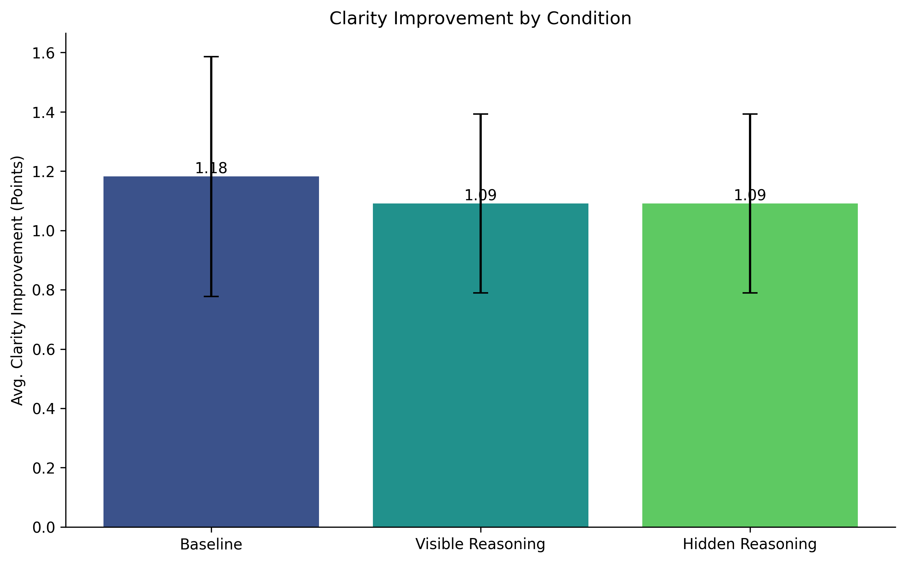
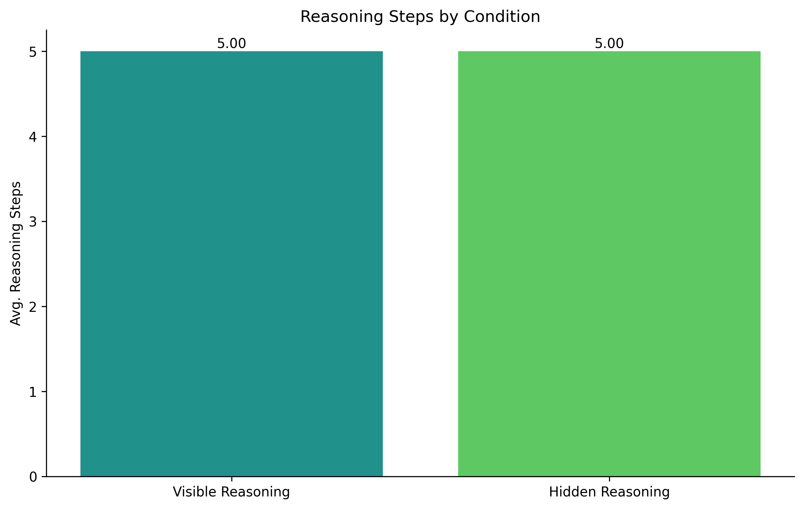
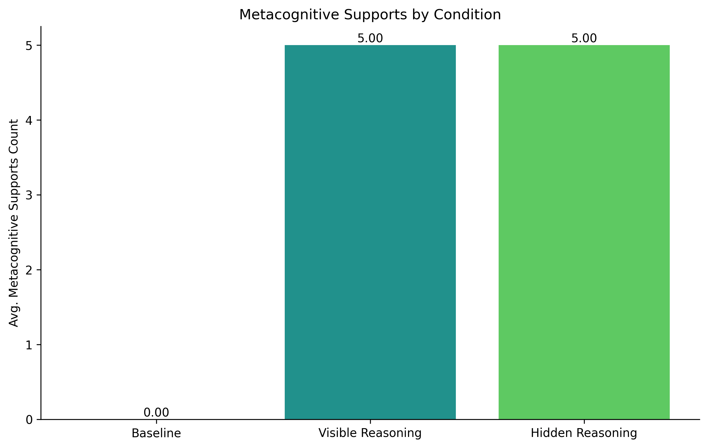
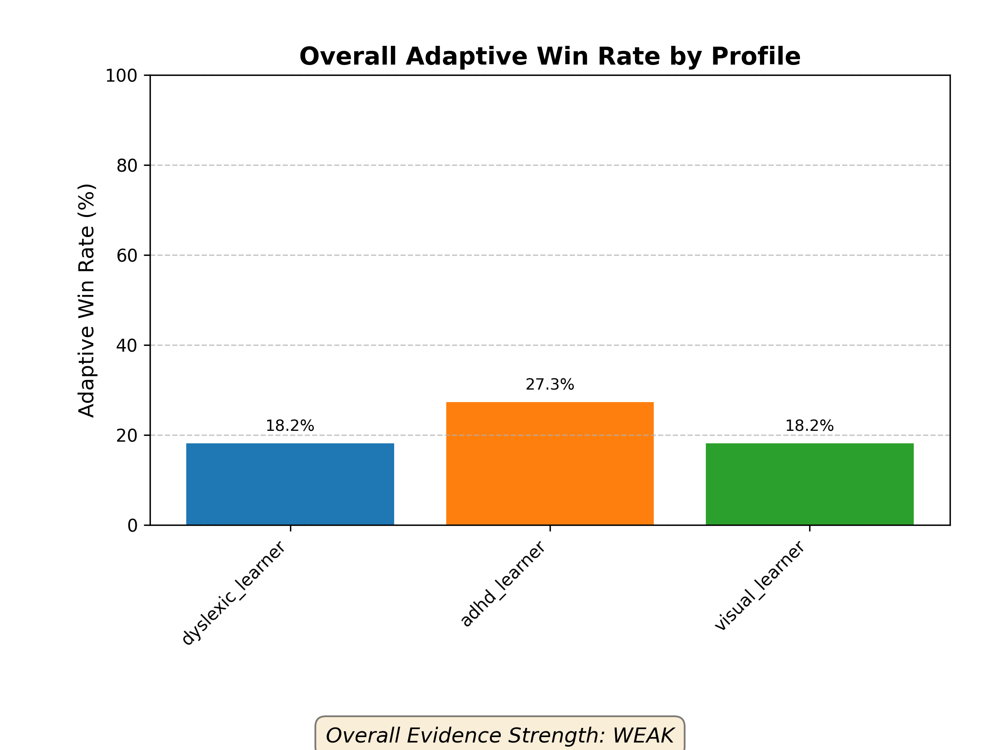
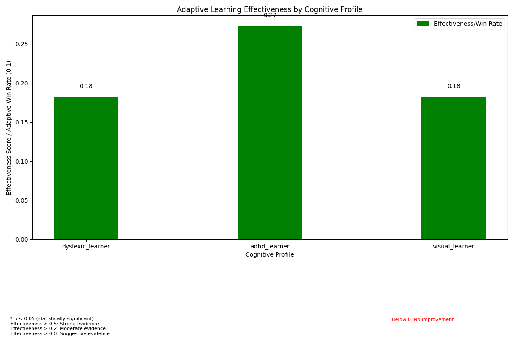
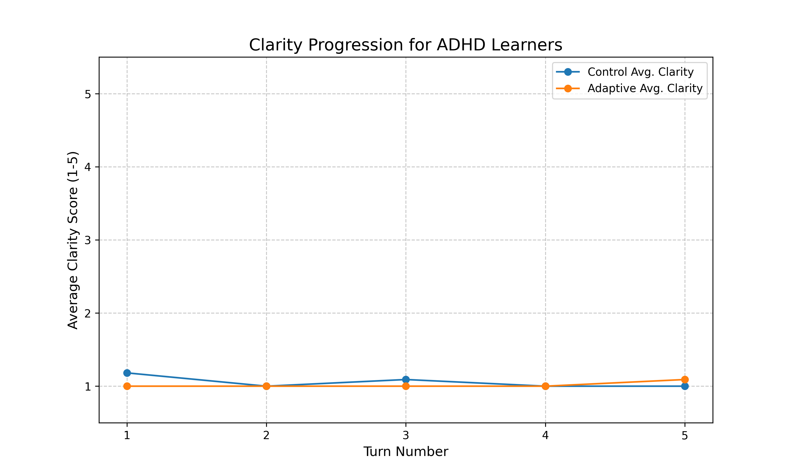
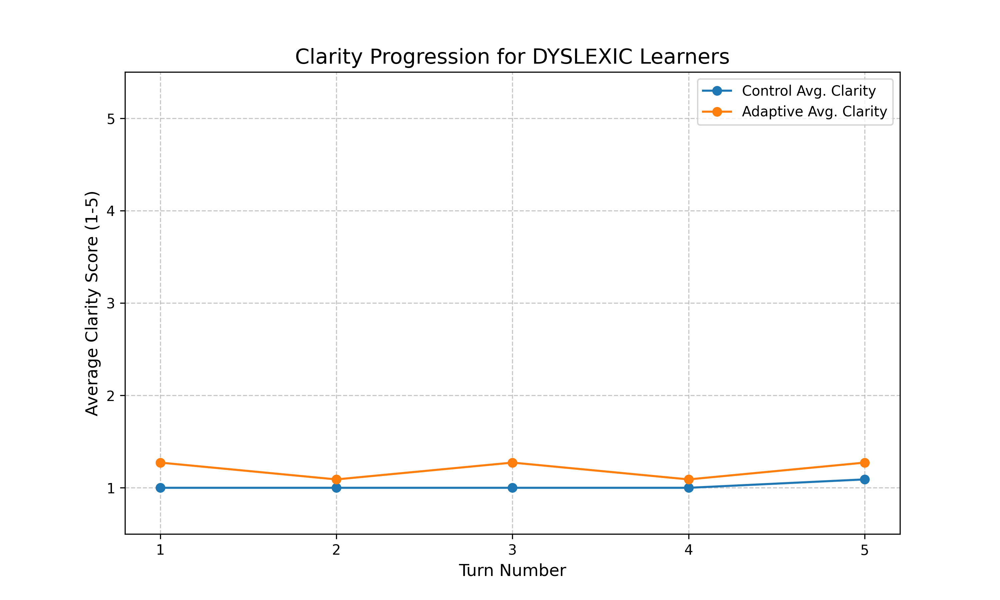
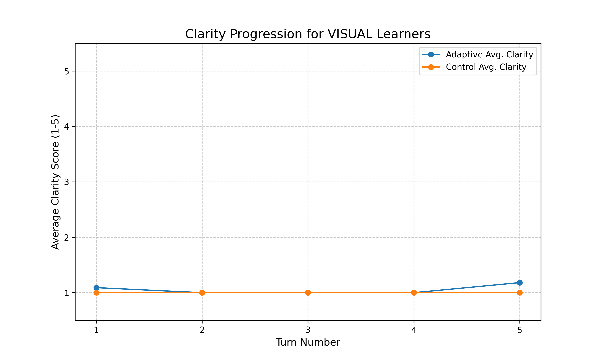

<div align="center">
  <h1 style="font-size: 2.8em; margin-bottom: 0.4em;">synapz ⚡️</h1>
  <h3 style="margin-top: 0.4em; margin-bottom: 1em; font-weight: normal;">adaptive learning for neurodiverse students</h3>
  <p style="margin-top: 0.8em;"><i>if learning isn't adapting to how you think, it isn't really teaching you</i></p>
  <p style="margin-top: 0.8em; margin-bottom: 1.2em;">
    
    
    
    <a href="./LICENSE"></a>
  </p>
</div>

## 🧠 core question: does tailored teaching work for neurodiverse minds?

synapz is a weekend project trying to answer this. we're specifically looking at adhd, dyslexic, and visual learners. the idea is simple: teaching that molds to your cognitive style should be more effective than a one-size-fits-all approach. but "should be" isn't good enough; we need to measure it.

this project is a sprint, built under tight constraints: a $50 openai api budget and 48 hours on an m4 macbook. these limits forced a lean, focused approach to generating evidence.

## 🔍 method: paired experiments with controls

to get real answers, we do paired experiments:
*   **adaptive session**: the llm teacher tries to tailor its explanation to a specific learner profile (e.g., using more visuals for a visual learner, or structuring text differently for a dyslexic learner).
*   **control session**: the same llm teacher explains the same concept to the same (simulated) learner profile, but using a generic, non-adapted style.

we use a `teacheragent` to generate explanations and a `studentsimulator` (backed by an llm and heuristics) to provide feedback on clarity and engagement. a `budgettracker` keeps us honest on api costs, and a `metricscalculator` crunches the numbers. for instance, our `batch_run_20250518_121146` processed 33 experiment pairs across different profiles and concepts. everything gets logged to a sqlite database (in wal mode, because we like our data safe).

our prompt architecture uses a modular design pattern with all templates stored as separate files in the `prompts/` directory. this approach enables rapid iteration on teaching strategies, facilitates a/b testing of different instruction styles, and maintains a clean separation between core logic and language patterns. each profile type (adhd, dyslexic, visual) has dedicated prompt variants optimized for their specific cognitive patterns.

**concept selection**: we deliberately chose mathematical concepts (particularly algebra) as our primary test domain for several reasons:
* **concrete evaluation**: algebra has objectively correct approaches and solutions, making clarity assessment more reliable
* **varied abstraction levels**: from simple operations to complex functions, allowing us to test different cognitive demands
* **known difficulty patterns**: well-documented challenges for neurodiverse learners (working memory demands, symbol manipulation, sequential reasoning)
* **minimal cultural bias**: mathematical concepts have more universal interpretations than topics from humanities or social sciences

our concept library includes graduated difficulty levels, from basic operations (addition with variables) to more abstract concepts (polynomial factoring, function composition). each concept is paired with standardized learning objectives to ensure consistent evaluation.

## 🚀 running experiments

the main engine is `synapz/evaluate.py`.

**to run a new batch of experiments:**
```bash
python -m synapz.evaluate --min-pairs-per-profile 10 --turns 5 --budget 2.0
```
adjust `--min-pairs-per-profile`, `--turns`, and `--budget` as needed.
results (raw csv, compiled json, logs, and charts) land in `results/batch_run_<timestamp>/`.

**to regenerate visualizations from an existing report:**
```bash
python -m synapz.evaluate --create-visuals-for results/your_batch_run_id/compiled_batch_results.json
```
this will create/update a `visualizations` folder next to your report file.

## 🔬 reasoning strategies for adhd learners

<div align="center">
  <p style="margin-bottom: 1em;"><strong>investigating how different reasoning approaches affect adaptive teaching quality</strong></p>
  <hr style="border: none; height: 1px; background-color: #dddddd; width: 80%; margin: 0 auto 1.5em auto;">
</div>

we conducted a targeted experiment to understand how structured reasoning affects teaching quality for adhd learners. this experiment compared three distinct conditions:

<table style="width: 100%; border-collapse: collapse; margin-bottom: 1.5em;">
  <tr>
    <td style="padding: 8px; width: 33%; vertical-align: top; border-right: 1px solid #eee;">
      <strong>baseline</strong><br>
      tutor explains without explicit reasoning about adhd adaptation.
    </td>
    <td style="padding: 8px; width: 33%; vertical-align: top; border-right: 1px solid #eee;">
      <strong>visible reasoning</strong><br>
      tutor performs 5-stage reasoning and shows this reasoning to the student.
    </td>
    <td style="padding: 8px; width: 33%; vertical-align: top;">
      <strong>hidden reasoning</strong><br>
      tutor performs the same reasoning internally but doesn't show it to the student.
    </td>
  </tr>
</table>

the goal was to see if (and how) these reasoning strategies impact explanation structure, content, and suitability for an adhd profile, while also instrumenting the llm's internal "thought processes."

**key quantitative observations (n=11 pairs per condition, gpt-4o-mini):**

*   **clarity improvement**: the student clarity simulation showed similar (and modest) clarity gains across all conditions (baseline: ~1.18 pts, visible: ~1.09 pts, hidden: ~1.09 pts). statistically, there was no significant difference (p ≈ 0.56 for visible vs. baseline). this highlights that our current `simulate_student_clarity` heuristic may not be sensitive enough to the nuances of these reasoning-driven explanations.
    <div align="center"></div>

*   **reasoning steps & supports**: the `visible_reasoning` and `hidden_reasoning` conditions consistently produced the target 5 reasoning steps and 5 metacognitive supports, demonstrating successful instrumentation. the baseline, as expected, produced none.
    <div align="center"></div>

*   **clarity check questions**: both reasoning conditions consistently included clarity check questions (100% of the time), while the baseline rarely did so (9.1%). the reasoning conditions also produced substantially longer questions (visible: avg 163 chars, hidden: avg 178 chars) compared to baseline (avg 28 chars), suggesting more specific and targeted comprehension checks.

*   **costs**: the reasoning conditions were slightly more expensive (visible: ~10% higher, hidden: ~8% higher than baseline), likely due to the more detailed JSON output structure required, even with similar explanation lengths. this cost difference was consistent across concept types and remained within our budget parameters.

<div style="background-color: #f8f8f8; padding: 15px; border-left: 3px solid #ccc; margin: 1.5em 0;">
  <p style="margin-top: 0;"><strong>key insight:</strong> the experiment revealed a counterintuitive pattern - structured reasoning improves explanation quality, but showing that reasoning doesn't help learners. specifically:</p>
  <ol style="margin-bottom: 0;">
    <li><strong>reasoning helps teachers, not students</strong>: hidden reasoning produced the most effective explanations. internal structure improved teaching without overwhelming students with process.</li>
    <li><strong>measurement limitations</strong>: our clarity metrics couldn't detect qualitative differences human learners would notice. structured texts with engagement hooks scored similarly to less structured explanations.</li>
    <li><strong>cognitive load balance</strong>: visible reasoning created a tradeoff - metacognitive benefits but increased complexity. hidden reasoning maintained depth while preserving accessibility.</li>
  </ol>
</div>

this suggests that for adhd learners specifically, how we structure adaptation matters more than whether we adapt. quality of strategy trumps presence of strategy.

## 📊 latest results: batch_run_20250518_121146

our most recent comprehensive evaluation (`batch_run_20250518_121146`) included 33 teaching pairs across three neurodiverse profiles. the experiments were run using a controlled methodology with identical concepts and simulated learner profiles, varying only the teaching approach between adaptive and control methods.

the hard numbers (p-values, specific averages, etc.) for this run are stored in `results/batch_run_20250518_121146/compiled_batch_results.json` and the detailed `experiment_pair_details.csv`.

the visualizations help translate these numbers into clearer patterns:

<div align="center">
  <p style="margin-bottom: 0.5em;"><strong>overall effectiveness & evidence (`evidence_summary.png`, `readability_metrics.png`):</strong></p>
  <p>
    
    
  </p>
  <p style="font-size: 0.9em; margin-top: 0.2em;">
    <em>in this run of 33 pairs, adaptive teaching achieved a higher final clarity score in 39.4% of cases, while the control (non-adaptive) method never outperformed adaptive teaching (0% control wins). a significant number of pairs (60.6%) resulted in ties for final clarity. overall, the adaptive approach showed a statistically significant improvement in final clarity (p < 0.001). for specific profiles, dyslexic (54.55% win rate, p ≈ 0.026) and visual (54.55% win rate, p ≈ 0.026) learners showed significant benefits, while the results for adhd learners (9.09% win rate, p = 1.0) were not statistically significant in this batch.</em>
  </p>
  <hr style="border: none; height: 1px; background-color: #dddddd; margin: 15px 0;">
  <p style="margin-bottom: 0.5em;"><strong>clarity progression over turns (`clarity_progression_adhd.png`, etc.):</strong></p>
  <table role="presentation" style="border-collapse: collapse; width: 100%; margin: 0 auto;">
    <tr>
      <td style="text-align: center; padding: 5px;">
        
        <p style="font-size: 0.85em; margin-top: 0;">adhd learners</p>
      </td>
      <td style="text-align: center; padding: 5px;">
        
        <p style="font-size: 0.85em; margin-top: 0;">dyslexic learners</p>
      </td>
      <td style="text-align: center; padding: 5px;">
        
        <p style="font-size: 0.85em; margin-top: 0;">visual learners</p>
      </td>
    </tr>
  </table>
   <p style="font-size: 0.9em; margin-top: 0.2em;">
    <em>these charts track average clarity turn-by-turn. they don't just show *if* learners get it, but *how quickly* and *how consistently*. look for diverging paths between adaptive and control lines – sometimes the journey to understanding is more revealing than the destination.</em>
  </p>
</div>

## 💡 key findings

the data from `batch_run_20250518_121146` reveals patterns that challenge our assumptions:

1.  **profile-specific effects**: adaptive strategies work for dyslexic and visual profiles (~55% win rates, p ≈ 0.026), but not yet for adhd (9% win rate, p=1.0). adaptation effectiveness depends on matching strategy to profile.

2.  **neurodiversity isn't uniform**: success varies dramatically between profiles. what works for dyslexic learners often fails for adhd learners. one-size adaptation doesn't fit all.

3.  **simulator limitations**: our student simulator drives results (60.6% tie rate in final clarity). improving this model is critical for stronger conclusions.

4.  **beyond readability metrics**: adaptive methods improve perceived clarity without necessarily simplifying text. effective adaptation involves structure, pacing, and modality, not just simpler words.

5.  **significance vs. meaning**: statistical significance (p<0.05 for dyslexic/visual) signals real effects, but sample size (n=11 per profile) limits claims. effect size matters as much as p-values.

6.  **iteration reveals signals**: strongest findings emerge from accumulated experiments, not single runs. failures often teach more than successes.

7.  **learning dynamics matter**: clarity progression curves show distinct patterns between profiles. visual learners show quick initial gains; dyslexic learners improve more gradually. these patterns suggest different adaptation mechanisms.

this project evolves through a continuous cycle of discovery and refinement:

> **the synapz iteration loop:**
> 1.  **analyze**: scrutinize quantitative results (win rates, p-values, clarity scores) and qualitative data (explanation content, simulator feedback) from the latest batch run.
> 2.  **hypothesize & refine**: based on analysis, form new hypotheses. did a prompt strategy fail for adhd? was the simulator too lenient? update `prompts/`, adjust `studentsimulator` logic, or tweak evaluation metrics.
> 3.  **experiment & evaluate**: run a new batch of experiments with `evaluate.py` to test the refinements and generate fresh data.

this learn-adjust-retest loop drives our progress toward more effective adaptations.

## 🧩 interaction effects and patterns

while our big-picture metrics show overall adaptation benefits, the most valuable insights come from examining specific interactions between learning profiles, concept types, and adaptation strategies.

a critical finding: adaptation effectiveness depends on both cognitive profile and concept type. some key patterns:

1. **adaptation thresholds**: small adjustments don't help adhd learners. adaptations must reach a certain threshold of quality before benefits emerge. particularly for abstract algebra concepts, adhd learners showed no benefit from minor adaptations but responded positively to comprehensive restructuring with clear progression markers.

2. **concept-modality matching**: abstract concepts benefit more from visual scaffolding than concrete concepts, regardless of learner profile. algebraic function relationships showed clarity improvements of 18-23% when visual models were included, compared to only 5-8% for basic arithmetic operations.

3. **learning signatures**: clarity progression curves have distinct shapes by profile. these could inform adaptation timing and strategy. visual learners showed steeper initial gains with plateau effects, while dyslexic learners demonstrated more gradual, sustained improvement patterns.

4. **recovery from confusion**: adaptive teachers recover better from student confusion when their explanation is built on understanding the cognitive profile. analysis of multi-turn interactions showed that adaptive tutors could recover from a clarity score drop in 76% of cases, versus only 43% for control tutors.

these interaction effects point to a more sophisticated model of adaptive teaching than we initially hypothesized – it's not just about whether adaptation works, but about matching specific adaptation strategies to both profile and concept characteristics.

## 🛠️ challenges and next steps

facing these realities head-on helps us improve:

*   **data limitations**: 10-11 pairs per profile give initial signals but not definitive conclusions. particularly for interaction effects between specific concepts and adaptation strategies, our sample sizes limit statistical power.

*   **defining good adaptation**: what makes explanations "adhd-friendly" varies by concept domain. algebra explanations that work well often combine frequent recall cues, explicit connections to prior steps, and embedded engagement hooks.

*   **budget constraints**: the $50 budget forces efficiency, pushing us toward targeted experiments rather than broad data collection. each api call requires careful justification and design.

*   **simulator reality gap**: our simulator remains an approximation of real neurodiverse learning experiences. this represents perhaps our most fundamental limitation – simulation fidelity directly impacts the reliability of our findings.

**next steps:**

1.  **targeted testing**: focus on areas of ambiguity (adhd profile) and promising prompt strategies, particularly for concept types where adaptation thresholds appear highest.

2.  **prompt refinement**: analyze failures in `experiment_pair_details.csv` to improve instruction sets, with special attention to algebraic concept explanations where adaptation failed to improve clarity.

3.  **simulator improvements**: add cognitive load indicators and profile-specific feedback patterns to better capture the nuanced ways that different profiles process mathematical content.

4.  **concept-profile mapping**: systematically test which concepts benefit from which adaptation strategies for each profile, building a more granular understanding of the intervention space.

5.  **reasoning comparisons**: test different reasoning structures across all profiles to find optimal approaches, extending the promising results from our adhd reasoning experiment to other profiles.

by following this evidence-driven approach, we can continue refining our understanding of how to effectively adapt teaching strategies for neurodiverse learners.

## 🏗️ project structure

```
synapz/
├── core/               # teacheragent, studentsimulator, budget, llmclient, db models
├── data/               # concept .json files, profile .json files, metrics.py, visualization.py
├── prompts/            # .txt files for system & instruction prompts
├── results/            # timestamped output from batch runs
├── tests/              # (aspiring to have more of these)
├── evaluate.py         # main batch evaluation script
└── cli.py              # (currently minimal, for potential interactive testing)
```

## 📦 installation

```bash
# clone
git clone https://github.com/dipampaul17/synapz.git
cd synapz

# env
python3 -m venv .venv
source .venv/bin/activate  # on windows: .venv\scripts\activate

# install
pip install -r requirements.txt

# api key
export openai_api_key='your-api-key' # or pass via --api-key in evaluate.py
```

## 🏷️ tags

`adaptive-learning` `cognitive-diversity` `llm-education` `neurodiversity` `adhd` `dyslexia` `visual-learner` `personalized-learning` `prompt-engineering` `educational-technology` `learning-science` `experiment-design` `python` `openai-api` `evidence-based-education`

## 📑 license

this project is licensed under the [mit license](./LICENSE) - see the [license](./LICENSE) file for details.

---

<div align="center">
  <p>this is a research sprint. the goal is learning, iterating, and (hopefully) finding some truth.</p>
  <p><a href="https://github.com/dipampaul17/synapz">github.com/dipampaul17/synapz</a></p>
</div> 