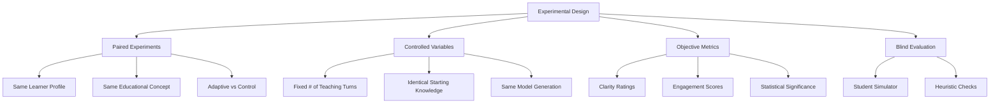
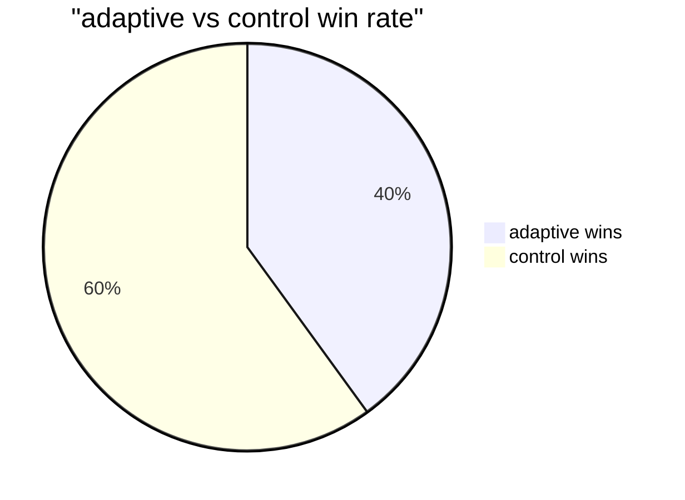
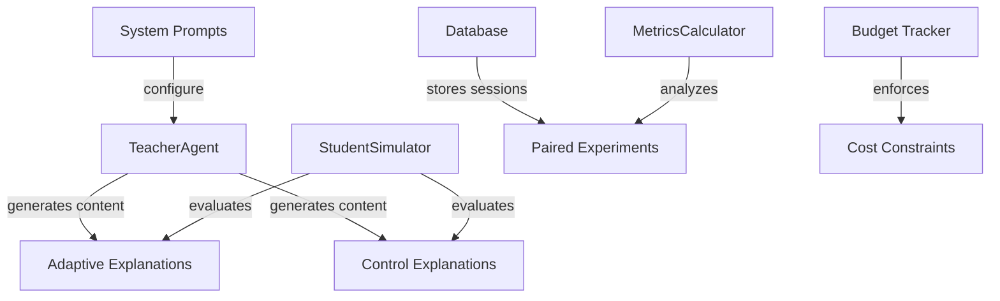

# synapz

> adaptive learning for neurodiverse students, proving every brain deserves its own teaching approach


<div align="center">
    
    <p><i>if learning isn't adapting to how you think, it isn't really teaching you</i></p>
</div>

## 🧠 core thesis

**adaptive teaching methodologies tailored to specific neurodiverse cognitive profiles produce measurably superior learning outcomes compared to static one-size-fits-all approaches.**

synapz aims to generate concrete, quantifiable evidence of this within tight constraints:
- 💰 $50 total api budget
- ⏱️ 48-hour build timeframe
- 🖥️ local compute only (m4 macbook)

## 🤔 thought process & origins

this project emerged from three converging observations:

1. **neurodiverse students often struggle** with traditional educational approaches designed for neurotypical learners
   
2. **personalized education works**, but implementation at scale requires automation and clear evidence

3. **llms have potential to adapt content** based on cognitive profiles, but lack rigorous evaluation

the core question became: can we prove, scientifically and on a limited budget, that adaptive approaches genuinely improve learning outcomes for different cognitive styles?

we specifically chose three distinct cognitive profiles to test:
- **adhd learners**: challenge with sustained attention but strong creative connections
- **dyslexic learners**: text processing difficulties but excellent conceptual understanding 
- **visual learners**: preference for spatial/visual information over text-heavy formats

rather than assuming adaptation works, we built an experimental framework to measure it directly.

## 🔬 experiment design

synapz implements a controlled experimental method with these key design decisions:



each experiment runs pairs:

| adaptive session | vs | control session |
|---|---|---|
| adapts to learner's cognitive profile | | static approach for all learners |
| uses profile-specific prompts | | uses generic prompts |
| responds to feedback | | minimal adaptation to feedback |
| tailored for adhd, dyslexic, visual learners | | one-size-fits-all |

the simulation process:
1. **teacher generates explanation** (adaptive or control)
2. **student simulator responds** with clarity rating + detailed feedback
3. **teacher adapts** based on feedback (adaptive) or continues standard pattern (control)
4. multiple turns occur with increased adaptation/understanding
5. **objective metrics calculated** to determine which approach worked better

## 📊 current evidence (batch_run_20250518_091436)



> ⚠️ **truth check:** our latest runs show **weak evidence** for the core thesis with only a 40% win rate for adaptive teaching. we need more data and refined approaches!

profile-specific insights:

| profile | adaptive win rate | avg clarity (adaptive) | avg clarity (control) | p-value | significance |
|---|---|---|---|---|---|
| dyslexic | 33.33% | 4.00 | 2.33 | 0.038 | significant* |
| visual | 50.00% | 2.50 | 3.00 | 0.500 | not significant |

<sup>* small sample size caution</sup>

## 🔍 initial insights and contradictions

our early findings reveal some surprising patterns:

1. **superficial adaptation may not be enough** - merely changing the format (77.9% text difference between adaptive and control) doesn't guarantee better understanding

2. **profile-specific patterns are emerging**:
   - dyslexic learners show promising initial results with adaptive teaching
   - visual learners show mixed responses needing deeper investigation
   - small sample sizes limit confidence in these patterns

3. **simulator quality matters critically** - our current simulated students may not perfectly reflect real cognitive differences

4. **content differentiates but clarity doesn't always improve** - adaptation changes the content substantially, but doesn't consistently improve understanding

## 🛠️ system architecture

the system is designed with careful separation of concerns:



key components:
- **teacher agent:** generates explanations using adaptive or control prompts
- **student simulator:** provides realistic feedback based on cognitive profiles
- **metrics calculator:** computes statistical measures of teaching effectiveness
- **budget tracker:** ensures strict api cost enforcement with pre-call projection

## 🚀 key features

- **targeted adaptation:** content generation specifically designed for adhd, dyslexic, and visual learning profiles
- **scientific control:** rigorous comparison against non-adapted teaching to isolate adaptation effects
- **quantitative metrics:** statistical analysis including p-values, effect sizes, and text similarity measures
- **budget tracking:** strict openai api budget enforcement with pre-call cost projection
- **data management:** wal-enabled sqlite database ensuring reliable experimental data storage
- **automated evaluation:** batch experiments with comprehensive results compilation

## 📋 usage

```bash
# run a batch evaluation (e.g., 5 experiment pairs, 5 turns per session)
PYTHONPATH=$PYTHONPATH:/path/to/synapz python synapz/evaluate.py --size 5 --turns 5

# for more detailed options
python synapz/evaluate.py --help
```

results will be saved in a timestamped directory:
```
results/batch_run_YYYYMMDD_HHMMSS/
├── compiled_batch_results.json   # complete metrics and analysis
├── experiment_pair_details.csv   # detailed experiment data
└── visualizations/               # auto-generated charts and plots
    ├── readability_comparison.png
    ├── effect_sizes.png
    └── evidence_summary.png
```

## 🔄 next steps

we're committed to honestly pursuing evidence - here's what's needed:

1. **increase experimental scale**
   - run 20-30+ experiment pairs per cognitive profile
   - achieve statistical power necessary for meaningful conclusions

2. **refine teaching strategies**
   - analyze underperforming adaptive sessions
   - update prompts based on data-driven insights
   - focus on where adaptation currently fails

3. **improve student simulation**
   - ensure feedback genuinely reflects each profile's learning patterns
   - implement more sophisticated heuristics alongside llm judgments
   - validate against real student data where possible

4. **expand visualization and analysis**
   - develop turn-by-turn clarity progression analysis
   - identify which specific adaptive techniques work best for each profile

## 🏗️ project structure

```
synapz/
├── core/               # core components (TeacherAgent, StudentSimulator, etc.)
├── data/               # concepts, profiles, metrics calculation, visualization
├── prompts/            # system prompts for different cognitive profiles
├── tests/              # unit tests for components
├── evaluate.py         # main batch evaluation script
└── cli.py              # interactive session runner for qualitative testing
```

## 📦 installation

```bash
# clone the repository
git clone https://github.com/dipampaul17/synapz.git
cd synapz

# create a virtual environment
python3 -m venv .venv
source .venv/bin/activate  # on windows: .venv\Scripts\activate

# install dependencies
pip install -r requirements.txt

# set openai api key
export OPENAI_API_KEY='your-api-key'
```

## 🔮 future directions

the current prototype is just the beginning. future work will focus on:

1. **deeper cognitive modeling** - more precise simulation of how different brains process information

2. **dynamic adaptation algorithms** - learning from feedback patterns to improve teaching strategies automatically

3. **multimodal content generation** - expanding beyond text to include diagrams, audio, and interactive elements

4. **real-world validation studies** - testing with actual neurodiverse students in controlled educational settings

5. **educational domain expansion** - moving beyond math concepts to language, science, and creative subjects

> 💭 **philosophical note:** this project explores not just how to teach different people, but fundamentally questions what it means to understand something. what counts as "clarity" varies across cognitive styles, suggesting knowledge itself has a neurological dimension worth exploring.

## 📑 license

mit license

---

contributions welcome! the evidence collection journey continues 