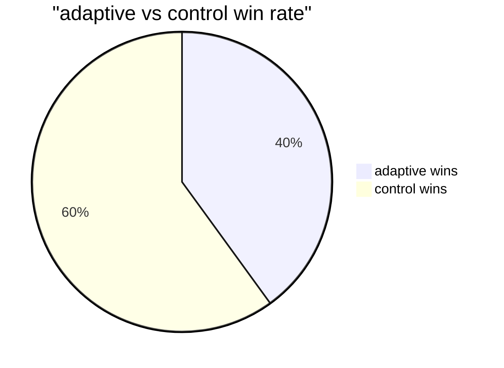
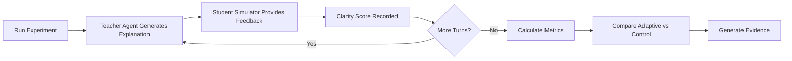

# synapz

> adaptive learning for neurodiverse students, proving every brain deserves its own teaching approach


<div align="center">
    
    <p><i>if learning isn't adapting to how you think, it isn't really teaching you</i></p>
</div>

## 🧠 core thesis

**adaptive teaching methodologies tailored to specific neurodiverse cognitive profiles produce measurably superior learning outcomes compared to static one-size-fits-all approaches.**

synapz aims to generate concrete, quantifiable evidence of this within tight constraints:
- 💰 $50 total api budget
- ⏱️ 48-hour build timeframe
- 🖥️ local compute only (m4 macbook)

## 🔬 the experiment

synapz runs paired experiments comparing:

| adaptive teaching | vs | control teaching |
|---|---|---|
| adapts to learner's cognitive profile | | static approach for all learners |
| uses profile-specific prompts | | uses generic prompts |
| responds to feedback | | minimal adaptation to feedback |
| tailored for adhd, dyslexic, visual learners | | one-size-fits-all |

## 📊 current evidence (batch_run_20250518_091436)



> ⚠️ **truth check:** our latest runs show **weak evidence** for the core thesis with only a 40% win rate for adaptive teaching. we need more data and refined approaches!

profile-specific insights:

| profile | adaptive win rate | avg clarity (adaptive) | avg clarity (control) | p-value | significance |
|---|---|---|---|---|---|
| dyslexic | 33.33% | 4.00 | 2.33 | 0.038 | significant* |
| visual | 50.00% | 2.50 | 3.00 | 0.500 | not significant |

<sup>* small sample size caution</sup>



## 🚀 key features

- **targeted adaptation:** content generation specifically designed for adhd, dyslexic, and visual learning profiles
- **scientific control:** rigorous comparison against non-adapted teaching to isolate adaptation effects
- **quantitative metrics:** statistical analysis including p-values, effect sizes, and text similarity measures
- **budget tracking:** strict openai api budget enforcement with pre-call cost projection
- **data management:** wal-enabled sqlite database ensuring reliable experimental data storage
- **automated evaluation:** batch experiments with comprehensive results compilation

## 📋 usage

```bash
# run a batch evaluation (e.g., 5 experiment pairs, 5 turns per session)
PYTHONPATH=$PYTHONPATH:/path/to/synapz python synapz/evaluate.py --size 5 --turns 5

# for more detailed options
python synapz/evaluate.py --help
```

results will be saved in a timestamped directory:
```
results/batch_run_YYYYMMDD_HHMMSS/
├── compiled_batch_results.json   # complete metrics and analysis
├── experiment_pair_details.csv   # detailed experiment data
└── visualizations/               # auto-generated charts and plots
    ├── readability_comparison.png
    ├── effect_sizes.png
    └── evidence_summary.png
```

## 🔄 next steps

we're committed to honestly pursuing evidence - here's what's needed:

1. **increase experimental scale**
   - run 20-30+ experiment pairs per cognitive profile
   - achieve statistical power necessary for meaningful conclusions

2. **refine teaching strategies**
   - analyze underperforming adaptive sessions
   - update prompts based on data-driven insights
   - focus on where adaptation currently fails

3. **improve student simulation**
   - ensure feedback genuinely reflects each profile's learning patterns
   - implement more sophisticated heuristics alongside llm judgments

4. **expand visualization and analysis**
   - develop turn-by-turn clarity progression analysis
   - identify which specific adaptive techniques work best for each profile

> 💡 **key insight:** differentiation alone isn't enough - we're seeing the system generate different content for different profiles (77.9% text difference), but this isn't consistently translating to better outcomes yet.

## 🏗️ project structure

```
synapz/
├── core/               # core components (TeacherAgent, StudentSimulator, etc.)
├── data/               # concepts, profiles, metrics calculation, visualization
├── prompts/            # system prompts for different cognitive profiles
├── tests/              # unit tests for components
├── evaluate.py         # main batch evaluation script
└── cli.py              # interactive session runner for qualitative testing
```

## 📦 installation

```bash
# clone the repository
git clone https://github.com/dipampaul17/synapz.git
cd synapz

# create a virtual environment
python3 -m venv .venv
source .venv/bin/activate  # on windows: .venv\Scripts\activate

# install dependencies
pip install -r requirements.txt

# set openai api key
export OPENAI_API_KEY='your-api-key'
```

## 📑 license

mit license

## 🔮 future vision

long-term, synapz aims to:

- achieve "irrefutable evidence" through scaled experiments
- develop dynamic adaptation that learns from interaction patterns
- validate with real neurodiverse students in controlled studies
- expand to cover more subject domains and profile types

the evidence collection journey continues - all contributions welcome 