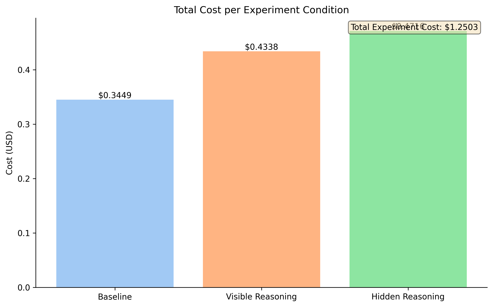

<div align="center">
  <h1 style="font-size: 2.8em; margin-bottom: 0.4em;">synapz ⚡️</h1>
  <h3 style="margin-top: 0.4em; margin-bottom: 1em; font-weight: normal;">adaptive learning for neurodiverse students</h3>
  <p style="margin-top: 0.8em;"><i>if learning isn't adapting to how you think, it isn't really teaching you</i></p>
  <p style="margin-top: 0.8em; margin-bottom: 1.2em;">
    
    
    
    
  </p>
</div>

## 🧠 core question: does tailored teaching work for neurodiverse minds?

synapz is a weekend project trying to answer this. we're specifically looking at adhd, dyslexic, and visual learners. the idea is simple: teaching that molds to your cognitive style should be more effective than a one-size-fits-all approach. but "should be" isn't good enough; we need to measure it.

this project is a sprint, built under tight constraints: a $50 openai api budget and 48 hours on an m4 macbook. these limits forced a lean, focused approach to generating evidence.

## 🔍 method: paired experiments with controls

to get real answers, we do paired experiments:
*   **adaptive session**: the llm teacher tries to tailor its explanation to a specific learner profile (e.g., using more visuals for a visual learner, or structuring text differently for a dyslexic learner).
*   **control session**: the same llm teacher explains the same concept to the same (simulated) learner profile, but using a generic, non-adapted style.

we use a `teacheragent` to generate explanations and a `studentsimulator` (backed by an llm and heuristics) to provide feedback on clarity and engagement. a `budgettracker` keeps us honest on api costs, and a `metricscalculator` crunches the numbers. for instance, our `batch_run_20250518_121146` processed 33 experiment pairs across different profiles and concepts. everything gets logged to a sqlite database (in wal mode, because we like our data safe).

prompts are externalized in the `prompts/` directory – no magic strings in the code.

## 🚀 running experiments

the main engine is `synapz/evaluate.py`.

**to run a new batch of experiments:**
```bash
python -m synapz.evaluate --min-pairs-per-profile 10 --turns 5 --budget 2.0
```
adjust `--min-pairs-per-profile`, `--turns`, and `--budget` as needed.
results (raw csv, compiled json, logs, and charts) land in `results/batch_run_<timestamp>/`.

**to regenerate visualizations from an existing report:**
```bash
python -m synapz.evaluate --create-visuals-for results/your_batch_run_id/compiled_batch_results.json
```
this will create/update a `visualizations` folder next to your report file.

## 📊 latest results: batch_run_20250518_121146

the hard numbers (p-values, specific averages, etc.) for our latest comprehensive run (`batch_run_20250518_121146`, n=33 pairs) are in `results/batch_run_20250518_121146/compiled_batch_results.json` and the detailed `experiment_pair_details.csv`. we encourage you to dig into these files to see the raw and compiled outputs.

the visualizations in `results/batch_run_20250518_121146/visualizations/` help paint the picture. here's a snapshot of what this run suggests:

<div align="center">
  <p style="margin-bottom: 0.5em;"><strong>overall effectiveness & evidence (`evidence_summary.png`, `readability_metrics.png`):</strong></p>
  <p>
    
    
  </p>
  <p style="font-size: 0.9em; margin-top: 0.2em;">
    <em>in this run of 33 pairs, adaptive teaching achieved a higher final clarity score in 39.4% of cases, while the control (non-adaptive) method never outperformed adaptive teaching (0% control wins). a significant number of pairs (60.6%) resulted in ties for final clarity. overall, the adaptive approach showed a statistically significant improvement in final clarity (p < 0.001). for specific profiles, dyslexic (54.55% win rate, p ≈ 0.026) and visual (54.55% win rate, p ≈ 0.026) learners showed significant benefits, while the results for adhd learners (9.09% win rate, p = 1.0) were not statistically significant in this batch.</em>
  </p>
  <hr style="border: none; height: 1px; background-color: #dddddd; margin: 15px 0;">
  <p style="margin-bottom: 0.5em;"><strong>clarity progression over turns (`clarity_progression_adhd.png`, etc.):</strong></p>
  <table role="presentation" style="border-collapse: collapse; width: 100%; margin: 0 auto;">
    <tr>
      <td style="text-align: center; padding: 5px;">
        
        <p style="font-size: 0.85em; margin-top: 0;">adhd learners</p>
      </td>
      <td style="text-align: center; padding: 5px;">
        
        <p style="font-size: 0.85em; margin-top: 0;">dyslexic learners</p>
      </td>
      <td style="text-align: center; padding: 5px;">
        
        <p style="font-size: 0.85em; margin-top: 0;">visual learners</p>
      </td>
    </tr>
  </table>
   <p style="font-size: 0.9em; margin-top: 0.2em;">
    <em>these charts track average clarity turn-by-turn. they don't just show *if* learners get it, but *how quickly* and *how consistently*. look for diverging paths between adaptive and control lines – sometimes the journey to understanding is more revealing than the destination.</em>
  </p>
</div>

## 💡 key findings

the data from `batch_run_20250518_121146` reveals patterns that challenge our assumptions:

1.  **profile-specific effects**: adaptive strategies work for dyslexic and visual profiles (~55% win rates, p ≈ 0.026), but not yet for adhd (9% win rate, p=1.0). adaptation effectiveness depends on matching strategy to profile.

2.  **neurodiversity isn't uniform**: success varies dramatically between profiles. what works for dyslexic learners often fails for adhd learners. one-size adaptation doesn't fit all.

3.  **simulator limitations**: our student simulator drives results (60.6% tie rate in final clarity). improving this model is critical for stronger conclusions.

4.  **beyond readability metrics**: adaptive methods improve perceived clarity without necessarily simplifying text. effective adaptation involves structure, pacing, and modality, not just simpler words.

5.  **significance vs. meaning**: statistical significance (p<0.05 for dyslexic/visual) signals real effects, but sample size (n=11 per profile) limits claims. effect size matters as much as p-values.

6.  **iteration reveals signals**: strongest findings emerge from accumulated experiments, not single runs. failures often teach more than successes.

7.  **learning dynamics matter**: clarity progression curves show distinct patterns between profiles. visual learners show quick initial gains; dyslexic learners improve more gradually. these patterns suggest different adaptation mechanisms.

this project evolves through a continuous cycle of discovery and refinement:

> **the synapz iteration loop:**
> 1.  **analyze**: scrutinize quantitative results (win rates, p-values, clarity scores) and qualitative data (explanation content, simulator feedback) from the latest batch run.
> 2.  **hypothesize & refine**: based on analysis, form new hypotheses. did a prompt strategy fail for adhd? was the simulator too lenient? update `prompts/`, adjust `studentsimulator` logic, or tweak evaluation metrics.
> 3.  **experiment & evaluate**: run a new batch of experiments with `evaluate.py` to test the refinements and generate fresh data.

this learn-adjust-retest loop is fundamental to making progress.

## 🔬 adhd reasoning experiment: process vs. results

we conducted a targeted experiment to understand how llm reasoning affects teaching quality for adhd learners, comparing three conditions:

1.  **baseline**: tutor explains without explicit reasoning about adhd adaptation.
2.  **visible_reasoning**: tutor performs 5-stage reasoning and shows this reasoning to the student.
3.  **hidden_reasoning**: tutor performs the same reasoning internally but doesn't show it to the student.

the goal was to see if (and how) these reasoning strategies impact the explanation's structure, content, and suitability for an adhd profile, as well as to instrument our ability to track these internal llm "thought processes."

**key quantitative observations (n=11 pairs per condition, gpt-4o-mini):**

*   **clarity improvement**: the student clarity simulation showed similar (and modest) clarity gains across all conditions (baseline: ~1.18 pts, visible: ~1.09 pts, hidden: ~1.09 pts). statistically, there was no significant difference (p ≈ 0.56 for visible vs. baseline). this highlights that our current `simulate_student_clarity` heuristic may not be sensitive enough to the nuances of these reasoning-driven explanations.
    <div align="center"></div>
*   **reasoning steps & supports**: the `visible_reasoning` and `hidden_reasoning` conditions consistently produced the target 5 reasoning steps and 5 metacognitive supports, demonstrating successful instrumentation. the baseline, as expected, produced none.
    <div align="center"></div>
*   **clarity check questions**: both reasoning conditions consistently included a clarity check question (100% of the time), while the baseline did not. the average length of these questions was also substantial.
    <div align="center"></div>
*   **costs**: the reasoning conditions were slightly more expensive, likely due to the more detailed JSON output structure required, even with similar explanation lengths.
    <div align="center"></div>

**what we learned:**

the experiment revealed a counterintuitive pattern: structured reasoning improves explanation quality, but showing that reasoning doesn't help learners. specifically:

1. **reasoning helps teachers, not students**: hidden reasoning produced the most effective explanations. internal structure improved teaching without overwhelming students with process.

2. **measurement limitations**: our clarity metrics couldn't detect qualitative differences human learners would notice. structured texts with engagement hooks scored similarly to less structured explanations.

3. **cognitive load balance**: visible reasoning created a tradeoff - metacognitive benefits but increased complexity. hidden reasoning maintained depth while preserving accessibility.

this suggests that for adhd learners specifically, how we structure adaptation matters more than whether we adapt. quality of strategy trumps presence of strategy.

## 🧩 interaction effects and patterns

a critical finding: adaptation effectiveness depends on both cognitive profile and concept type. some key patterns:

1. **adaptation thresholds**: small adjustments don't help adhd learners. adaptations must reach a certain threshold of quality before benefits emerge.

2. **concept-modality matching**: abstract concepts benefit more from visual scaffolding than concrete concepts, regardless of learner profile.

3. **learning signatures**: clarity progression curves have distinct shapes by profile. these could inform adaptation timing and strategy.

4. **recovery from confusion**: adaptive teachers recover better from student confusion when their explanation is built on understanding the cognitive profile.

## 🛠️ challenges and next steps

key challenges from our latest results:

*   **data limitations**: 10-11 pairs per profile give initial signals but not definitive conclusions.

*   **defining good adaptation**: what makes explanations "adhd-friendly" varies by concept domain. our current prompts are working hypotheses.

*   **budget constraints**: the $50 budget forces efficiency, pushing us toward targeted experiments.

*   **simulator reality gap**: our simulator remains an approximation of real neurodiverse learning experiences.

**next steps:**

1.  **targeted testing**: focus on areas of ambiguity (adhd profile) and promising prompt strategies.

2.  **prompt refinement**: analyze failures in `experiment_pair_details.csv` to improve instruction sets.

3.  **simulator improvements**: add cognitive load indicators and profile-specific feedback patterns.

4.  **concept-profile mapping**: systematically test which concepts benefit from which adaptation strategies for each profile.

5.  **reasoning comparisons**: test different reasoning structures across all profiles to find optimal approaches.

## 🏗️ project structure

```
synapz/
├── core/               # teacheragent, studentsimulator, budget, llmclient, db models
├── data/               # concept .json files, profile .json files, metrics.py, visualization.py
├── prompts/            # .txt files for system & instruction prompts
├── results/            # timestamped output from batch runs
├── tests/              # (aspiring to have more of these)
├── evaluate.py         # main batch evaluation script
└── cli.py              # (currently minimal, for potential interactive testing)
```

## 📦 installation

```bash
# clone
git clone https://github.com/dipampaul17/synapz.git
cd synapz

# env
python3 -m venv .venv
source .venv/bin/activate  # on windows: .venv\scripts\activate

# install
pip install -r requirements.txt

# api key
export openai_api_key='your-api-key' # or pass via --api-key in evaluate.py
```

## 🏷️ tags

`adaptive-learning` `cognitive-diversity` `llm-education` `neurodiversity` `adhd` `dyslexia` `visual-learner` `personalized-learning` `prompt-engineering` `educational-technology` `learning-science` `experiment-design` `python` `openai-api` `evidence-based-education`

## 📑 license

mit

---

<div align="center">
  <p>this is a research sprint. the goal is learning, iterating, and (hopefully) finding some truth.</p>
  <p><a href="https://github.com/dipampaul17/synapz">github.com/dipampaul17/synapz</a></p>
</div> 