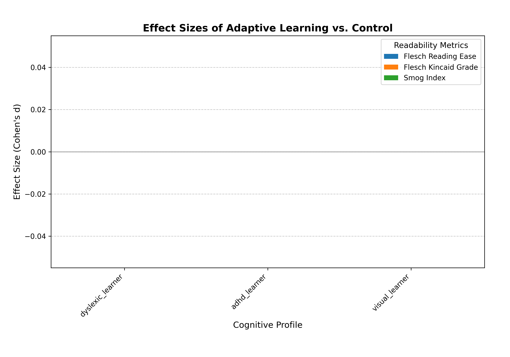

<div align="center">
  <h1 style="font-size: 2.8em; margin-bottom: 0.4em;">synapz ⚡️</h1>
  <h3 style="margin-top: 0.4em; margin-bottom: 1em; font-weight: normal;">adaptive learning for neurodiverse students</h3>
  <p style="margin-top: 0.8em;"><i>if learning isn't adapting to how you think, it isn't really teaching you</i></p>
  <p style="margin-top: 0.8em; margin-bottom: 0.8em;">
    
    
    
    
  </p>
</div>

## the core question: does adaptive teaching actually work better for neurodiverse students?

synapz is a weekend project trying to answer this. we're specifically looking at adhd, dyslexic, and visual learners. the idea is simple: teaching that molds to your cognitive style should be more effective than a one-size-fits-all approach. but "should be" isn't good enough; we need to measure it.

this project is a sprint, built under tight constraints: a $50 openai api budget and 48 hours on an m4 macbook. these limits forced a lean, focused approach to generating evidence.

## our approach: controlled experiments and careful measurement

to get real answers, we do paired experiments:
*   **adaptive session**: the llm teacher tries to tailor its explanation to a specific learner profile (e.g., using more visuals for a visual learner, or structuring text differently for a dyslexic learner).
*   **control session**: the same llm teacher explains the same concept to the same (simulated) learner profile, but using a generic, non-adapted style.

we use a `teacheragent` to generate explanations and a `studentsimulator` (backed by an llm and heuristics) to provide feedback on clarity and engagement. a `budgettracker` keeps us honest on api costs, and a `metricscalculator` crunches the numbers. everything gets logged to a sqlite database (in wal mode, because we like our data safe).

prompts are externalized in the `prompts/` directory – no magic strings in the code.

## how to run it & see what happens

the main engine is `synapz/evaluate.py`.

**to run a new batch of experiments:**
```bash
python -m synapz.evaluate --min-pairs-per-profile 10 --turns 5 --budget 2.0
```
adjust `--min-pairs-per-profile`, `--turns`, and `--budget` as needed.
results (raw csv, compiled json, logs, and charts) land in `results/batch_run_<timestamp>/`.

**to regenerate visualizations from an existing report:**
```bash
python -m synapz.evaluate --create-visuals-for results/your_batch_run_id/compiled_batch_results.json
```
this will create/update a `visualizations` folder next to your report file.

## what we're seeing (insights from `batch_run_20250518_121146`)

the hard numbers (p-values, specific averages, etc.) for our latest run are in `results/batch_run_20250518_121146/compiled_batch_results.json` and `experiment_pair_details.csv`. we encourage you to dig in.

the visualizations in `results/batch_run_20250518_121146/visualizations/` help paint the picture:

<div align="center">
  <p style="margin-bottom: 0.5em;"><strong>overall effectiveness & evidence (`evidence_summary.png`, `readability_metrics.png`):</strong></p>
  <p>
    
    
  </p>
  <p style="font-size: 0.9em; margin-top: 0.2em;">
    <em>these give a high-level look at adaptive 'win rates' by profile and overall effectiveness scores. are adaptive methods consistently outperforming control? the answer is likely nuanced and varies by profile.</em>
  </p>
  <hr style="border: none; height: 1px; background-color: #dddddd; margin: 20px 0;">
  <p style="margin-bottom: 0.5em;"><strong>clarity progression over turns (`clarity_progression_adhd.png`, etc.):</strong></p>
  <table role="presentation" style="border-collapse: collapse; width: 100%; margin: 0 auto;">
    <tr>
      <td style="text-align: center; padding: 5px;">
        
        <p style="font-size: 0.85em; margin-top: 0;">adhd learners</p>
      </td>
      <td style="text-align: center; padding: 5px;">
        
        <p style="font-size: 0.85em; margin-top: 0;">dyslexic learners</p>
      </td>
      <td style="text-align: center; padding: 5px;">
        
        <p style="font-size: 0.85em; margin-top: 0;">visual learners</p>
      </td>
    </tr>
  </table>
   <p style="font-size: 0.9em; margin-top: 0.2em;">
    <em>these charts track average clarity turn-by-turn. they don't just show *if* learners get it, but *how quickly* and *how consistently*. look for diverging paths between adaptive and control lines – sometimes the journey to understanding is more revealing than the destination.</em>
  </p>
   <hr style="border: none; height: 1px; background-color: #dddddd; margin: 20px 0;">
  <p style="margin-bottom: 0.5em;"><strong>magnitude of differences (`effect_sizes.png`):</strong></p>
  <p>
     
  </p>
  <p style="font-size: 0.9em; margin-top: 0.2em;">
    <em>this chart shows cohen's d effect sizes for readability metrics. it tells us *how much* the adaptive explanations differ from control in terms of standard textual properties. significant structural differences (see text/tag diffs in the raw data) might not always translate to large shifts in these standard readability scores, hinting that 'neurodiverse-friendly' might be more complex than just 'simpler text'.</em>
  </p>
</div>

**emerging (and often messy) insights:**

1.  **adaptation is not magic**: simply telling an llm to "be adaptive" for a profile like "visual learner" doesn't automatically yield superior explanations. the *quality and specificity* of adaptation strategies in the prompts are paramount. superficial changes (e.g., just adding more bullet points) might not cut it.
2.  **profiles are not monoliths**: what works for one "adhd learner" simulation might not for another, depending on the concept's nature and the specific adaptive tactics tried. the visualizations might show different adaptive "win rates" or clarity trajectories even within the same broad profile category if we could segment further (e.g., by concept difficulty).
3.  **simulator fidelity is key (and hard)**: our student simulator (llm + heuristics) tries its best, but it's a proxy. its feedback (clarity, engagement) drives the "measured" success. if the simulator doesn't truly capture a neurodiverse student's interaction patterns, our conclusions are built on a shaky foundation. the heuristic metrics (like abstractness score, sentence length) provide a partial cross-check.
4.  **"clarity" is multifaceted**: an llm-simulated clarity score is one thing. objective readability scores (like flesch-kincaid from `textstat`) are another. the `effect_sizes.png` might show that adaptive explanations are, say, *more* complex by one metric but perceived as clearer by the simulator. this tension is where interesting insights lie.
5.  **statistical significance vs. practical impact**: with enough runs, small differences can become statistically significant (low p-values). the `effect_sizes.png` (cohen's d) helps us see if these differences are also practically meaningful. sometimes, an adaptation might be "better" but not by much.

the journey is iterative. each batch run from `evaluate.py` provides data to refine prompts, simulator logic, and our understanding of what "effective adaptation" even means.

## the tricky bits & what's next

this is research, so it's full of challenges:
*   **getting enough data**: small sample sizes (even 10-15 pairs per profile) make it hard to draw strong statistical conclusions for specific profiles vs. specific concepts. we need more runs.
*   **defining "good" adaptation**: what specific instructional strategies truly work best for an adhd profile when explaining algebra vs. history? our prompts are hypotheses themselves.
*   **the cost constraint**: the $50 budget means we can't just run thousands of experiments with the most powerful models. every llm call counts.

**immediate focus:**
1.  **more data, wisely**: run more experiment pairs, perhaps focusing on profiles/concepts where results are currently ambiguous or counterintuitive. use the `--min-pairs-per-profile` flag in `evaluate.py`.
2.  **prompt refinement**: based on the detailed data in `experiment_pair_details.csv` from the latest run, identify adaptive sessions that underperformed and analyze *why*. update the instruction sets in `prompts/`.
3.  **simulator enhancements**: can we add more sophisticated heuristics to `studentsimulator` that better correlate with neurodiverse processing? for example, tracking cognitive load indicators beyond simple readability.

## 🏗️ project structure

```
synapz/
├── core/               # teacheragent, studentsimulator, budget, llmclient, db models
├── data/               # concept .json files, profile .json files, metrics.py, visualization.py
├── prompts/            # .txt files for system & instruction prompts
├── results/            # timestamped output from batch runs
├── tests/              # (aspiring to have more of these)
├── evaluate.py         # main batch evaluation script
└── cli.py              # (currently minimal, for potential interactive testing)
```

## 📦 installation

```bash
# clone
git clone https://github.com/dipampaul17/synapz.git
cd synapz

# env
python3 -m venv .venv
source .venv/bin/activate  # on windows: .venv\\scripts\\activate

# install
pip install -r requirements.txt

# api key
export openai_api_key='your-api-key' # or pass via --api-key in evaluate.py
```

## 🏷️ tags

`adaptive-learning` `cognitive-diversity` `llm-education` `neurodiversity` `adhd` `dyslexia` `visual-learner` `personalized-learning` `prompt-engineering` `educational-technology` `learning-science` `experiment-design` `python` `openai-api` `evidence-based-education`

## 📑 license

mit

---

<div align="center">
  <p>this is a research sprint. the goal is learning, iterating, and (hopefully) finding some truth.</p>
  <p><a href="https://github.com/dipampaul17/synapz">github.com/dipampaul17/synapz</a></p>
</div> 